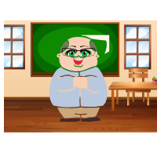

# 👋 Olá, eu sou o Marcos Felix!
## Feliz 😁
🎓 Professor por vocação, programador por diversão e eterno curioso por natureza.  
📚 Apaixonado por ensinar, aprender e transformar código em conhecimento.

---

## 👨‍🏫 Sobre mim

- 💼 Atuo como professor, ajudando mentes brilhantes a desbravar o mundo da tecnologia.
- 🧠 Curioso por novas linguagens, metodologias e aquele bug que "não devia estar acontecendo".
- 🎯 Buscando sempre unir teoria, prática e um pouquinho de humor na sala de aula (e nos commits).
- ☕️ Sobrevivo a base de café e boas ideias.

---

## 💻 Tecnologias que uso com frequência

*E claro, o eterno amor por um bom `print("Olá, mundo!")`.*

---

## 📊 GitHub Stats

  
  

---

## 🤝 Vamos conectar?

- 💼 [LinkedIn](https://www.linkedin.com/in/seu-perfil)
- 🌐 [Meu site/página institucional](https://www.seusite.com)
- 🐦 [Twitter (X)](https://twitter.com/seuuser)
- 📫 Me envie um e-mail: marcos.felix@escola.pr.gov.br

-               
---

html

  

<h1 align="center">Hi There people! 👋</h1>
<h2 align="center">I'm Mr. Felix</h2>
<h3 align="center">I'm a very curious student.</h3>

<em>Connect with me:</em> <strong>Mr-Felix25</strong> 📫

<h2 align="left">Languages and Tools:</h2>

  
  
  

  <strong>Missão Programador</strong> 
  Olha só o que podemos afirmar sobre você... 
  Você se destaca pelo dinamismo, gostando de aprender e ajustar durante o processo.
  <strong>Independência</strong> define sua abordagem para resolver problemas, confiando nas suas habilidades de pesquisa.
  Detalhista, você dá muita importância à aparência e à experiência do usuário.
  Curiosidade é uma marca sua, sempre em busca de novas ferramentas e técnicas.
  <strong>Independência</strong> é uma preferência sua, gostando de ter controle total sobre seus projetos.

  
  
  
  
  

