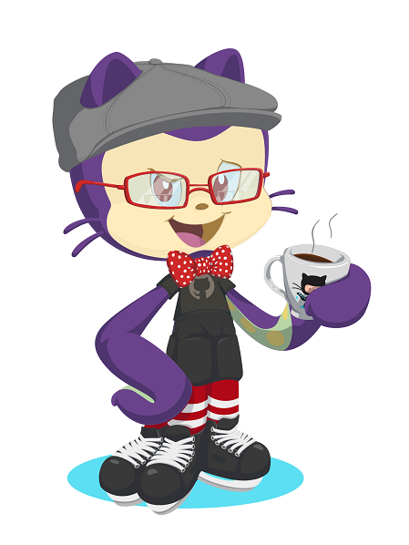
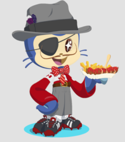

<h1 align="center">Hi 👋, I'm Mr Felix</h1>
<h3 align="center">I'm a very curious student.</h3>

<h3 align="left">Connect with me:</h3>

<h3 align="left">Languages and Tools:</h3>

    

  :-)    

  Missão Programador
###Olha só o que podemos afirmar sobre você...
Você se destaca pela dinamismo, gostando de aprender e ajustar durante o processo. **Independência** define sua abordagem para resolver problemas, confiando nas suas habilidades de pesquisa. Detalhista, você dá muita importância à aparência e à experiência do usuário. Curiosidade é uma marca sua, sempre em busca de novas ferramentas e técnicas. Independência é uma preferência sua, gostando de ter controle total sobre seus projetos.

